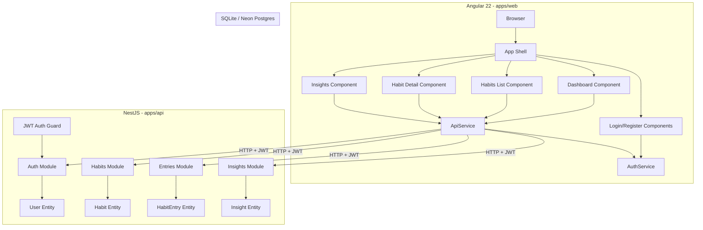

# Architecture

## System Overview

## Data Flow

1. **Auth flow**: User registers/logs in -> AuthController -> AuthService hashes password and returns JWT -> stored in localStorage by Angular AuthService
2. **Habit CRUD**: Angular component calls ApiService -> HTTP request with JWT -> HabitsController validates -> HabitsService handles business logic -> TypeORM persists
3. **Entry logging**: Quick log from dashboard or detail page -> EntriesController upserts by date+habitId -> streak recalculated client-side via computed()
4. **Insights generation**: User clicks "Generate" -> InsightsController loads habits with entries -> InsightsService analyzes patterns - streaks, weekly distribution, summary -> persists to DB

## Key Design Decisions

- **Signals over RxJS**: All component state uses Angular signals (`signal()`, `computed()`). RxJS is used only at the HTTP boundary via `HttpClient.subscribe()`.
- **Standalone components**: No NgModules, every component is standalone with lazy-loaded routes.
- **Thin controllers**: All business logic lives in services, not controllers.
- **Strategy-pattern AI**: InsightsService uses a pluggable analysis engine that can be swapped for an LLM-backed implementation without changing the controller or API contracts.
- **Zoneless-ready**: The Angular app uses zoneless change detection for better performance, though currently configured with zone.js for compatibility.
