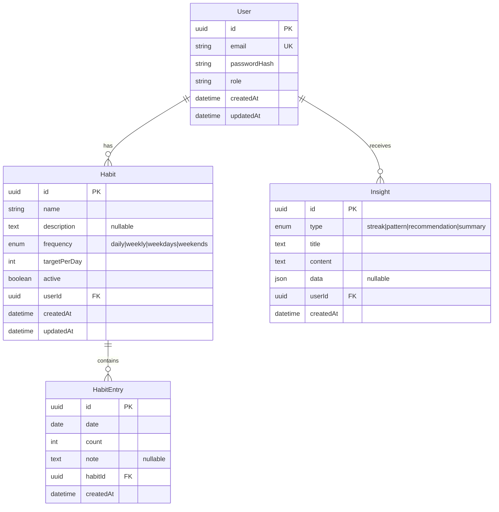

# Database

## Schema



## Migration Strategy

**Development**: TypeORM `synchronize: true` auto-creates tables on server start. This is safe for development but should be disabled in production.

**Production**: The repo includes SQL migration files in `apps/api/migrations/`. To run migrations:

```bash
# With TypeORM CLI
npx typeorm migration:run -d ormconfig.ts
```

The recommended migration tool is **Drizzle Kit** for production schema management, paired with raw SQL for complex migrations.

## Neon-Specific Choices

This project is architected to work with **Neon (serverless Postgres)** in production:

- **Branching**: Create a dedicated database branch per feature for isolated development
- **Connection pooling**: Use Neon's pooled connection string for serverless environments
- **Data API**: For direct frontend reads, the `neon` http endpoint can serve RLS-protected queries
- **PGVector**: If upgrading to Rung 3 (semantic search), enable `pgvector` extension on the branch

Current setup uses **better-sqlite3** for zero-config local development. Switch to `postgres` driver by changing:
1. `DATABASE_TYPE=postgres` in `.env`
2. `DATABASE_URL` to Neon connection string
3. Comment/uncomment the appropriate TypeORM config in `app.module.ts`

## Current Database

When running with SQLite, the database file is stored at `apps/api/data/habits.db`. This file is gitignored. The seed script populates it with 1 user, 6 habits, and ~14 days of entries.
